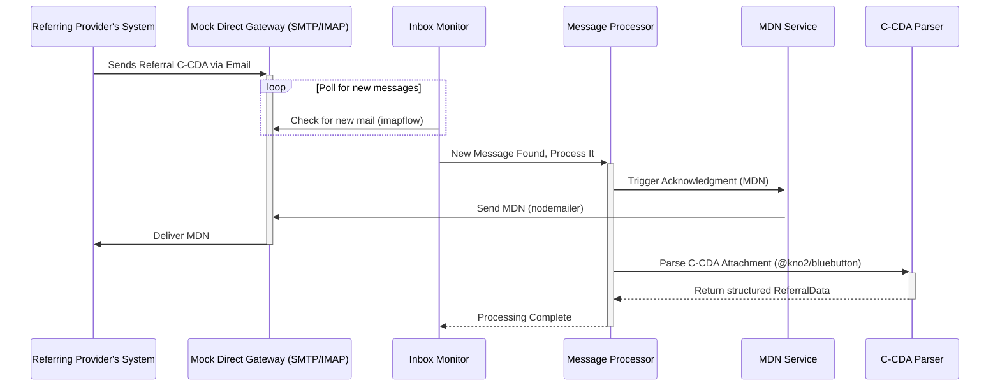

# Engineering Architecture: PRD-01 - Receive and Acknowledge Referral Request

This document outlines the proposed software architecture for implementing the requirements of **PRD-01: Receive and Acknowledge Referral Request**.

---

### 1. High-Level Summary

The proposed architecture consists of a background service that continuously monitors a mock Direct Secure Messaging gateway (an IMAP inbox) for incoming referral messages. When a message is received, the service will process it, validate the presence of a C-CDA attachment, and immediately dispatch a Message Delivery Notification (MDN) to the original sender to acknowledge receipt. Subsequently, it will parse the C-CDA document using `@kno2/bluebutton` to extract key patient and referral information, holding it in memory for the next stage of the workflow. The system is designed to be modular, allowing for easy testing and future expansion.

---

### 2. Technology Stack

The project uses a **Node.js/TypeScript** stack.

*   **Language:** TypeScript (Node.js 20+)
*   **C-CDA Parsing:** `@kno2/bluebutton` – The industry-standard library for converting C-CDA XML into a developer-friendly JSON object.
*   **Email Transport (Outbound):** `nodemailer` – For sending MDN acknowledgments via the mock SMTP gateway.
*   **Email Transport (Inbound):** `imapflow` – For polling the mock IMAP inbox for new referral messages.
*   **Testing:** `jest` with `ts-jest` – Standard TypeScript testing framework.

> **Note:** The `hl7` (npm) package is a project-wide dependency for HL7 V2 message construction but is **not used in PRD-01**. PRD-01 only sends an email-format MDN (RFC 3798) via `nodemailer`. The `hl7` package is first used in PRD-02 for `RRI^I12` generation.

**Justification:** This stack keeps the entire project in a single language and runtime. `@kno2/bluebutton` is the primary reason for choosing Node.js — it is the most actively maintained, industry-tested C-CDA parser available. TypeScript adds type safety that is especially valuable when working with complex healthcare data structures.

---

### 3. System Components

The application will be broken down into the following discrete modules:

1.  **Inbox Monitor (`inboxMonitor.ts`):**
    *   **Responsibility:** Periodically polls the mock IMAP inbox for new messages.
    *   **Mechanism:** Runs on a configurable polling interval (e.g., every 10 seconds) using `imapflow`.
    *   **Output:** When a new message is found, passes the raw email content to the `Message Processor`.

2.  **Message Processor (`messageProcessor.ts`):**
    *   **Responsibility:** Receives a raw email, extracts the sender's address, and identifies the C-CDA attachment.
    *   **Logic:**
        *   Determines the sender address for the MDN response.
        *   Immediately triggers the `MDN Service`.
        *   Checks for a `.xml` or `.cda` attachment.
        *   If an attachment is found, passes it to the `C-CDA Parser`.
        *   If not, logs an internal error as per the acceptance criteria.

3.  **C-CDA Parser (`cdaParser.ts`):**
    *   **Responsibility:** Uses `@kno2/bluebutton` to extract required fields from the C-CDA XML.
    *   **Interface:** A function that takes the C-CDA file content as a string.
    *   **Output:** A structured `ReferralData` TypeScript object containing the patient's name, DOB, and reason for referral.

4.  **MDN Service (`mdnService.ts`):**
    *   **Responsibility:** Constructs and sends a standards-compliant MDN email reply back to the original sender using `nodemailer`.
    *   **Format:** An MDN is an **email-protocol notification** (RFC 3798), not an HL7 V2 message. It is a `multipart/report` email with two parts:
        *   **Part 1 — Human-readable:** A plain-text body (e.g., `"Your referral message was received and is being processed."`).
        *   **Part 2 — Machine-readable:** A `message/disposition-notification` block containing:
            *   `Original-Message-ID`: The `Message-ID` header of the inbound referral email. This is how the referring provider correlates the MDN back to the message they sent.
            *   `Final-Recipient`: The Direct address of the receiving system.
            *   `Disposition`: `automatic-action/MDN-sent-automatically; processed`
    *   **Key point:** The `Message-ID` of the inbound email must be extracted by the `Message Processor` and passed to this service. No HL7 library is used here — this is handled entirely by `nodemailer`.

---

### 4. Data Models

The `C-CDA Parser` will produce an in-memory data object defined as a TypeScript interface.

**In-Memory `ReferralData` Object:**

```typescript
interface Patient {
  firstName: string;
  lastName: string;
  dateOfBirth: string; // ISO 8601 format: YYYY-MM-DD
}

interface ReferralData {
  sourceMessageId: string;
  patient: Patient;
  reasonForReferral: string;
  isCdaValid: boolean;
}
```

This object will be logged to the console for now and will serve as the input for the services developed in PRD-02.

---

### 5. API Design

There are no external web APIs for this service. The "API" consists of the internal function signatures that connect the components.

```typescript
// cdaParser.ts
function parseCda(cdaXmlContent: string): ReferralData

// messageProcessor.ts
// FetchMessageObject is the message type provided by imapflow
async function processInboundMessage(msg: FetchMessageObject): Promise<void>
// 1. Trigger MDN send-back
// 2. Extract attachment
// 3. cdaParser.parseCda(attachment)
// 4. Log the resulting ReferralData object

// inboxMonitor.ts
async function pollInbox(): Promise<void>
// Loops on interval, calling processInboundMessage for each new email
```

---

### 6. User Flow

The following sequence diagram illustrates the automated workflow.



---

### 7. Prerequisite for PRD-02: Persistence Layer

PRD-01 is intentionally stateless — parsed data lives in memory only. However, **before coding on PRD-02 begins**, a persistence layer must be established. Every PRD from PRD-02 onward requires reading and writing referral state to a database.

**Decision: SQLite + Drizzle ORM**

*   **SQLite** — File-based, zero infrastructure, no separate server or Docker container required. Ideal for a PoC. Migrating to PostgreSQL later is a one-line config change in Drizzle.
*   **Drizzle ORM** (`drizzle-orm`, `@drizzle-team/drizzle-kit`) — TypeScript-native schema definitions, type-safe queries, and auto-generated migrations.

**Initial Schema (covers all PRDs):**

```typescript
// db/schema.ts
import { sqliteTable, text, integer } from 'drizzle-orm/sqlite-core';

export const patients = sqliteTable('patients', {
  id: integer('id').primaryKey({ autoIncrement: true }),
  firstName: text('first_name').notNull(),
  lastName: text('last_name').notNull(),
  dateOfBirth: text('date_of_birth').notNull(), // ISO 8601
});

export const referrals = sqliteTable('referrals', {
  id: integer('id').primaryKey({ autoIncrement: true }),
  patientId: integer('patient_id').references(() => patients.id).notNull(),
  sourceMessageId: text('source_message_id').notNull().unique(), // original email Message-ID
  referrerAddress: text('referrer_address').notNull(),           // Direct address to reply to
  reasonForReferral: text('reason_for_referral'),
  state: text('state').notNull().default('Received'),            // state machine value
  createdAt: integer('created_at', { mode: 'timestamp' }).notNull(),
  updatedAt: integer('updated_at', { mode: 'timestamp' }).notNull(),
});

export const outboundMessages = sqliteTable('outbound_messages', {
  id: integer('id').primaryKey({ autoIncrement: true }),
  referralId: integer('referral_id').references(() => referrals.id).notNull(),
  messageControlId: text('message_control_id').notNull().unique(), // HL7 MSH-10
  messageType: text('message_type').notNull(),                     // 'RRI', 'SIU', 'ConsultNote'
  status: text('status').notNull().default('Pending'),             // 'Pending' | 'Acknowledged'
  sentAt: integer('sent_at', { mode: 'timestamp' }).notNull(),
  acknowledgedAt: integer('acknowledged_at', { mode: 'timestamp' }),
});
```

**Valid `referrals.state` values** (full lifecycle):
`Received` → `Acknowledged` → `Accepted` | `Declined` → `Scheduled` → `Encounter` → `Closed` → `Closed-Confirmed`

---

### 8. Key Considerations

*   **Error Handling:**
    *   **Missing C-CDA:** The `Message Processor` must handle cases where an email arrives without an attachment. It will still trigger the MDN but will log an internal error.
    *   **Malformed C-CDA:** The `C-CDA Parser` must be wrapped in a `try/catch` block to handle parsing errors from `@kno2/bluebutton` and log them appropriately. The `isCdaValid` flag in the `ReferralData` model signals this failure downstream.
*   **Configuration:** All external details (SMTP/IMAP server address, port, credentials, polling interval) must be stored in a `.env` file and loaded via a config module. Nothing should be hardcoded.
*   **Scalability:** The current polling mechanism is simple and effective for a proof-of-concept. In a production system, this would be replaced by an event-driven architecture (e.g., a message queue or a webhook) to eliminate polling and improve responsiveness.
*   **Idempotency:** The monitor should track processed message IDs to avoid reprocessing the same referral if the service restarts. For PRD-01, a simple in-memory `Set` of processed IDs persisted to a local file on shutdown is sufficient. From PRD-02 onward, this is superseded by the `unique` constraint on `referrals.sourceMessageId` in the database — a duplicate insert will fail cleanly rather than reprocessing.
